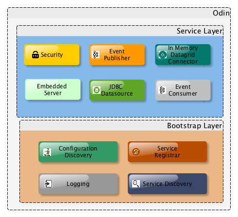

# Odin #

## Introduction ##
Odin is platform to build microservices. The name Odin is taken from the norse mythology, in Norse mythology, Odin was the king of the Æsir. He is a god of war and death, as well as a sky god and the god of wisdom and poetry. Along with being a god, he is the All-Father of all the Nordic Gods. 

## Architecture ##
The Odin micro-services platform is based on spring boot, which provides a light weight container on top of which swift wallet can build the micro-services required meet the business requirements.

Odin has a layered architecture that consists of

* Bootstrap Layer -  A light weight runtime that provides management features for the runtime and extends spring boot for handling the wiring up of the different services. 
* Services Layer -  A layer of embedded services that sits on top of the bootstrap layer.

The diagram below shows the different components

### Bootstrap Layer ###
The Odin boostrap layer is based on spring boot runtime, the bootstrap layer boots up the micro-services and provides the following features:

* Configuration Discovery
* Logging
* Service Registration
* Service Discovery

### Services Layer ###
The services layer provides different services required by the microservices, it consists of:

* Security
* Event Publish/Subscribe
* JDBC Datasource 
* In Memory Datagrid Connector
* Embedded Server

### Technology Stack ###

* Spring Boot 1.4.2 RELEASE
* Spring Framework 4.3.5 RELEASE
* Apache ZooKeeper 3.4.9
* Apache Curator 3.2.1
* Logback
* Spring Security
* Jetty Server 9.3.1
* Hikari CP
* Spring Kafka

## Building from Source ##
To build you will need to install JDK 1.8

Odin uses maven for build related activities, the following command will build the project

`$ ./mvnw install`

NOTE: You can also install Maven (>=3.3.3) yourself and run the `mvn` command
in place of `./mvnw`, like this, `$ mvn install`

NOTE: Be aware that you might need to increase the amount of memory
available to Maven by setting a `MAVEN_OPTS` environment variable with
a value like `-Xmx512m -XX:MaxPermSize=128m`. We try to cover this in
the `.mvn` configuration

## Configurations

### Embedded Server
Odin uses embdedd jetty(9.3.1) server for its http services and servlet container. It also supports HTTP/2(SPDY protocol developed by google).

`/configuration/<micro-service-id>/<environment>/server/port=<port>` default is 8080

`/configuration/<micro-service-id>/<environment>/server/jmx-port=<jmx-port>` default is 1099

`/configuration/<micro-service-id>/<environment>/server/ssl-enabled=<ssl-enabled>` default is false

### Security
Odin uses spring security to provide authentication/authorization. It support digest as well as OAuth2 based authentication.

`/configuration/odin/<environment>/security/digest=authorize-mode=AUTHENTICATED`

`/configuration/odin/<environment>/security/digest=realm=<realm-name>`

`/configuration/odin/<environment>/security/user=name=<user-name>`

`/configuration/odin/<environment>/security/user=password=<password>`

`/configuration/odin/<environment>/security/oauth2=enabled=<true-or-false>` - Default is false

`/configuration/odin/<environment>/security/oauth2=authorization-server=<true-or-false>` - To enable authorization server

`/configuration/odin/<environment>/security/oauth2=resource-server=<true-or-false>` - To enable resource server

### Datasource (JDBC)

Odin uses HikariCP for Connection pooling. Following are the configurations supported by the datasource.

`/configuration/<micro-service-id>/<environment>/jdbc/data-source/enabled=<true-or-false>`- by default it is disabled

`/configuration/<micro-service-id>/<environment>/jdbc/data-source/names=<comma separted list of datasources>`

`/configuration/<micro-service-id>/<environment>/jdbc/data-source/<name>/jdbc-url=<jdbc-url>`

`/configuration/<micro-service-id>/<environment>/jdbc/data-source/<name>/user-name=<user-name>`

`/configuration/<micro-service-id>/<environment>/jdbc/data-source/<name>/password=<password>`

`/configuration/<micro-service-id>/<environment>/jdbc/data-source/<name>/driver-class-name=<driver-class-name>`

`/configuration/<micro-service-id>/<environment>/jdbc/data-source/<name>/auto-commit=<auto-commit>` - default is false

`/configuration/<micro-service-id>/<environment>/jdbc/data-source/<name>/connection-test-query=<connection-test-query>` - for some of the dbs like mysql this is mandatory

`/configuration/<micro-service-id>/<environment>/jdbc/data-source/<name>/cache-prep-stmts=<cache-prep-stmts>`

`/configuration/<micro-service-id>/<environment>/jdbc/data-source/<name>/prep-stmt-cache-size=<prep-stmt-cache-size>`

`/configuration/<micro-service-id>/<environment>/jdbc/data-source/<name>/cache-prep-stmts=<cache-prep-stmts>`

`/configuration/<micro-service-id>/<environment>/jdbc/data-source/<name>/prep-stmt-cache-sql-limit=<prep-stmt-cache-sql-limit>`

`/configuration/<micro-service-id>/<environment>/jdbc/data-source/<name>/maximum-pool-size=<maximum-pool-size>`

`/configuration/<micro-service-id>/<environment>/jdbc/data-source/<name>/max-life-time=<max-life-time>`

`/configuration/<micro-service-id>/<environment>/jdbc/data-source/<name>/idle-timeout=<idle-timeout>`

## License ##
Odin is Open Source software released under the 
[Apache 2.0 license](http://www.apache.org/licenses/LICENSE-2.0.html)

