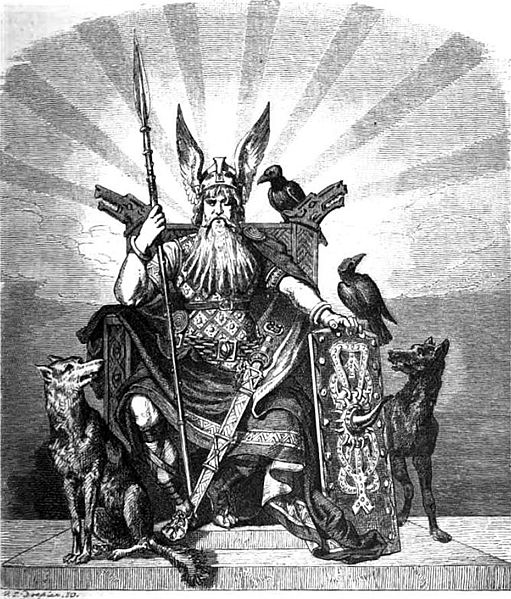

#Odin#
##Introduction##
Odin is platform to build microservices. The name Odin is taken from the norse mythology, in Norse mythology, Odin was the king of the Æsir. He is a god of war and death, as well as a sky god and the god of wisdom and poetry. Along with being a god, he is the All-Father of all the Nordic Gods. 

##Architecture##
The Odin micro-services platform is based on spring boot, which provides a light weight container on top of which swift wallet can build the micro-services required meet the business requirements.

Odin has a layered architecture that consists of

* Bootstrap Layer -  A light weight runtime that provides management features for the runtime and extends spring boot for handling the wiring up of the different services. 
* Services Layer -  A layer of embedded services that sits on top of the bootstrap layer.

The diagram below shows the different components

###Bootstrap Layer###
The Odin boostrap layer is based on spring boot runtime, the bootstrap layer boots up the micro-services and provides the following features:

* Configuration Discovery
* Logging
* Service Registration
* Service Discovery

###Services Layer###
The services layer provides different services required by the microservices, it consists of:

* Security
* Event Publish/Subscribe
* JDBC Datasource 
* In Memory Datagrid Connector
* Embedded Server

###Technology Stack###

* Spring Boot 1.4.2 RELEASE
* Spring Framework 4.3.5 RELEASE
* Apache ZooKeeper 3.4.9
* Apache Curator 3.2.1
* Logback
* Spring Security
* Jetty Server 9.3.1
* Hikari CP
* Spring Kafka

